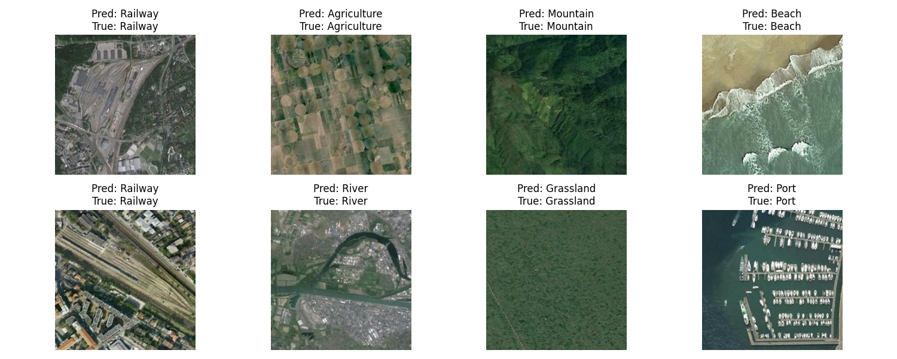
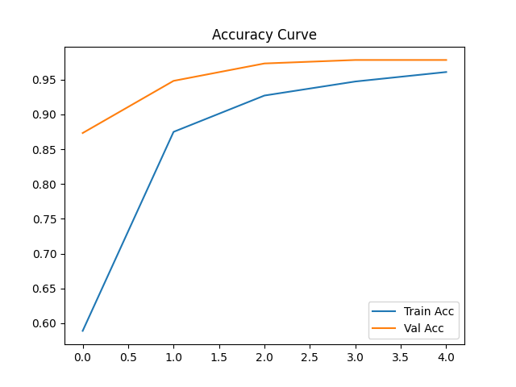
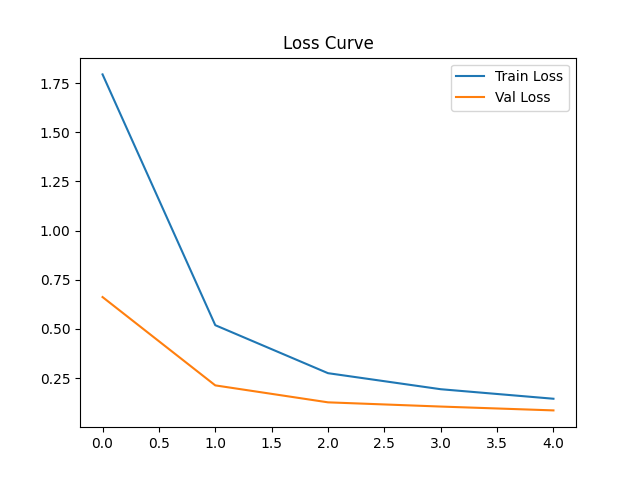

# Aerial Landscape Image Classification 🛰️

Aerial image classification using ResNet-18 (pretrained) with PyTorch and timm


# Features:

 - Training & validation loop with progress bar (tqdm)
 - Custom Dataset class (AerialDataset)
 - Pretrained ResNet-18 backbone from timm


# Directory Structure

```
.
├── assets/                   # Training result
│   └── accuracy_curve.png    # Curve accuracy on training and validation
│   └── loss_curve.png        # Curve loss on training and validation
│   └── predictions.png       # Predictions result of the model
├── data/
│   └── Aerial_Landscapes/    # Folder contains images, its classes, and csv file
├── src/
│   └── model.py              # define ResNet wrapper
│   └── dataset.py            # AerialData Dataset
│   └── train.py              # training & evaluation loop
│   └── utils.py              # make csv file in data/
│   └── visualize.py          # visualization
├── main.py                   # main part
└── README.md
```

# How to Training

```
!python main.py --path "data/Aerial_Landscapes/" --epochs 5 --num_workers 2
```

# Result

Prediction results on the test dataset:




